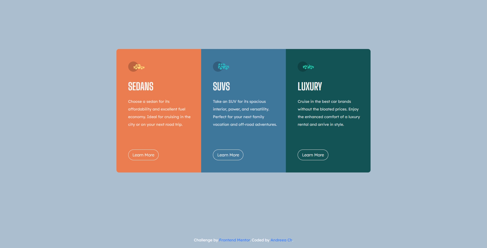
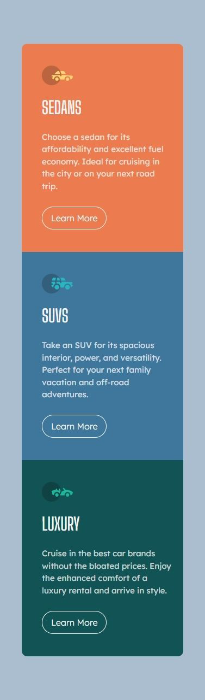

# Frontend Mentor - 3-column preview card component solution

This is a solution to the [3-column preview card component challenge on Frontend Mentor](https://www.frontendmentor.io/challenges/3column-preview-card-component-pH92eAR2-). Frontend Mentor challenges help you improve your coding skills by building realistic projects. 

## Table of contents

- [Overview](#overview)
  - [The challenge](#the-challenge)
  - [Screenshot](#screenshot)
  - [Links](#links)
- [My process](#my-process)
  - [Built with](#built-with)
  - [Other tools used](#other-tools-used)
  - [What I learned](#what-i-learned)
  - [Useful resources](#useful-resources)

**Note: Delete this note and update the table of contents based on what sections you keep.**

## Overview

### The challenge

Users should be able to:

- View the optimal layout depending on their device's screen size
- See hover states for interactive elements

### Screenshot





### Links

- Solution URL: [https://github.com/andr-ch/3-column-preview-card-component.git](https://github.com/andr-ch/3-column-preview-card-component.git)
- Live Site URL: [https://andr-ch.github.io/3-column-preview-card-component/](https://andr-ch.github.io/3-column-preview-card-component/)


## My process

### Built with

- Semantic HTML5 markup
- CSS custom properties
- Bootstrap 4.6.2 - For responsive design and styling
- Flexbox - For layout
- Mobile-first workflow
- Google Fonts - Custom fonts (Big Shoulders Display and Lexend Deca)


### Other tools used:
- Pesticide extension: This tool is perfect for outlining each element to better visualize their placement on the page during development.
- Developer tools: Available on any browser, these tools are ideal for experimenting with changes to your page's HTML, CSS, and JavaScript without affecting your code directly.


### What I Learned

### What I Learned

1. **Using Bootstrap to style and layout the content:**
a.**Implemented a responsive layout using Bootstrap's grid system (container-fluid, row, col-md-4) to ensure compatibility across various devices and screen sizes:**
```html
<main class="container-fluid bg-main">
    <div class="row">
        <div class="car1-section col-md-4">
            <!-- Content for Sedans -->
        </div>
        <div class="car2-section col-md-4">
            <!-- Content for SUVs -->
        </div>
        <div class="car3-section col-md-4">
            <!-- Content for Luxury cars -->
        </div>
    </div>
</main>
```
b.*Utilized the `bg-main` class to create a spacious main content section:**
 ```css
.bg-main {
    padding: 12rem 3rem;
}
```

c.**Styled buttons for improved visual appeal:**
```html
<button class="btn btn-lg btn-outline-light rounded-pill learn-more-button" type="button">Learn More</button>
```
    Here I used:
    - `btn-lg`: Increases button size for better visibility.
    - `btn-outline-light`: Creates a light outlined border for clarity.
    - `rounded-pill`: Applies rounded corners to the button.

2. **Styling and creating create a flexible, rounded container:**
 ```css
.row {
    max-width: 55%;
    border-radius: 10px;
    overflow: hidden;
    display: flex;
}
```
    Here I used:
- `max-width: 55%`: Ensures the container adapts to different screen sizes but doesn't exceed a certain width.
- `border-radius: 10px`: Applies rounded corners to the container.
- `overflow: hidden`: Hides any content that exceeds the specified dimensions of the container and uses flexbox for layout flexibility.
- `display: flex`: Enables flex container properties for easier alignment of child elements.

3. **Using flex properties for responsive and centered layouts:**
 ```css
.container-fluid {
    display: flex;
    flex-wrap: wrap;
    justify-content: center;
    align-items: center;
}
```
Here I used: 
- `flex-wrap: wrap`: Allows items to wrap to the next line when necessary.
- `justify-content: center` and `align-items: center`: Centers items horizontally and vertically within the container.


### Useful resources

- [Bootstrap Documentation ](https://getbootstrap.com/docs/4.6/getting-started/introduction/) - This helped me understand how to use Bootstrap's grid system and utility classes effectively. It was particularly useful for organizing content and ensuring responsiveness across different screen sizes.

- [Google Fonts](https://fonts.google.com/) - This resource was invaluable for integrating custom fonts into my project. I used the Inter and Lexend Deca fonts, which greatly enhanced the visual appeal of my webpage.

- [CSS Tricks ](https://css-tricks.com/snippets/css/a-guide-to-flexbox/) - This article on Flexbox helped me understand how to align and distribute space among items in a container, which was essential for styling my stats section and ensuring it looked good on all devices.

- [MDN Web Docs on CSS Media Queries](https://developer.mozilla.org/en-US/docs/Web/CSS/CSS_media_queries/Using_media_queries) - This resource was crucial for learning how to apply different styles based on screen size. It allowed me to create a responsive design that adapts to various screen resolutions.

- [CSSmatic - Border Radius Generator ](https://www.cssmatic.com/border-radius) - Helpful for experimenting and generating CSS styles such as border radius, box shadow, and more.

